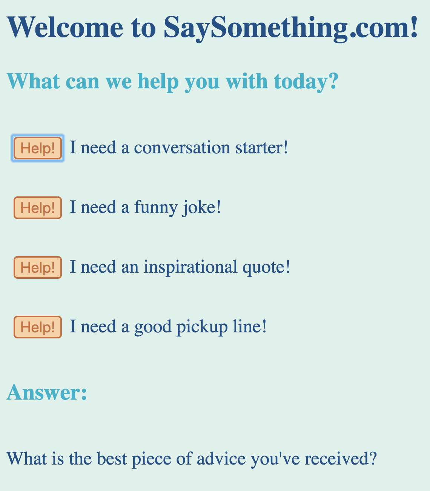

This is a project I completed as a student at [hackreactor](http://hackreactor.com).  This was my first solo full stack project.

# SaySomething.com
### A helpful web app for when things get awkward.

## Overview
* Whether you are trying to keep the conversation going on a date, or just trying to entertain yourself on a long roadtrip, long periods of silence can be awkward.  Sometimes uncomfortable topics come up and you need a way to change the subject quickly.  On SaySomething.com you can easily generate random conversation starters with the click of a button.  Now you can also request a jokes, quotes, and pickup lines too!

## The Problem
* For some people conversation comes naturally, but for the rest of us it can be more challenging.  
* Long periods of silence can be very awkward.
* Sometimes conversations become uncomfortable and you need to change the subject.
* Other times you just need a laugh, inspiration, or a good pick up line.

## Our Solution
* On SaySomething.com you can generate conversation starters with the click of a button.
* We will send you an answer from our collection.
* If you need more help later in your conversation, or if you don't like the topic we provided, just click the button again for some more ideas.
* Don't forget, we also added jokes, quotes, and pickup lines for your enjoyment!

## Here's a quote from our founder:
* "I am a pretty quiet person who always struggles to get conversations going.  Now I no longer have to worry about coming up with conversation topics myself." ~Alex Simrell

## How To Get Started
* Simply visit our website at SaySomething.com and click one of the help buttons.
* We will send you a response from our large collection of carefully selected conversations, jokes, quotes, and pickup lines that we're sure you'll love.
* Repeat as needed.

## Here's a quote from one of our customers:
* "Thanks to SaySomething.com I can now talk about other things besides apples." ~Johnny Appleseed

## Don't let your conversations get awkward anymore!  Never run out of things to say with SaySomething.com! 
### Start using SaySomething.com today!
